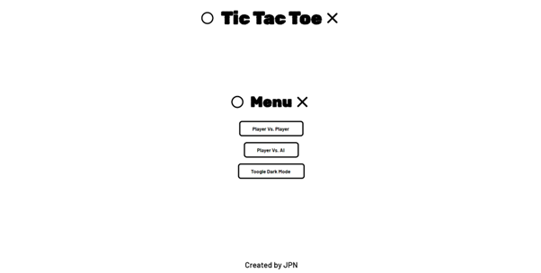
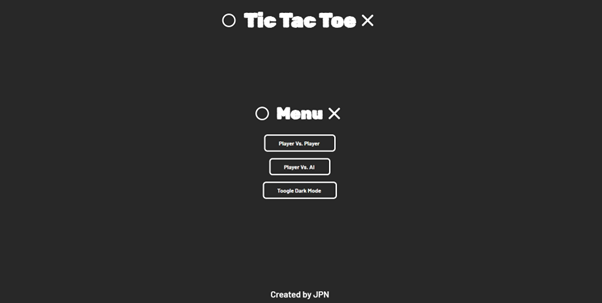
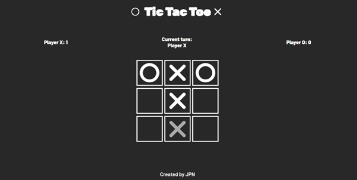
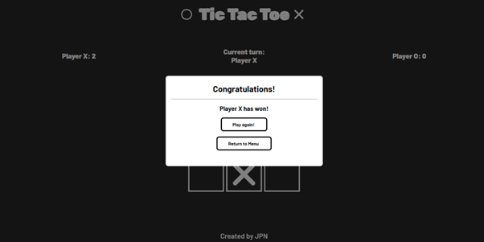

# Tic-Tac-Toe Game

    

    

    

    

## Description

This is a classic two-player React based game where the user can challenge a friend, family member or the AI to a friendly match of tic-tac-toe. It's a simple yet engaging game that tests the users strategic thinking and tactics.

## Features

- Multiplayer mode: challange a friend or family member to a friendly match of tic-tac-toe
- Singleplayer mode: challange the game's AI to a match of tic-tac-toe
- Difficulty select: depending on the selected difficulty, the AI playes better of worse
- Score tracking: when entering the game, the score is being above the playing board for the specific session
- Dark mode toggle: for those who like the darker side of things. The status is being saved with [local storage](https://developer.mozilla.org/en-US/docs/Web/API/Window/localStorage)
- Responsive design for seamless gameplay on different devices.

## Live demo

You can try out the Quiz Game by visiting the [live demo](https://zack1808.github.io/tic-tac-toe)

## How to run the game

If you want to run the app localy:

#### 1. Clone the repository

- HTTPS: `git clone https://github.com/Zack1808/tic-tac-toe.git`
- SSH: `git clone git@github.com:Zack1808/tic-tac-toe.git`
- GitHub CLI: `gh repo clone Zack1808/tic-tac-toe`

#### 2. Enter the project directory

`cd tic-tac-toe`

#### 3. Allow the app to install the necessary packages (Node.js has to be installed on the device)

`npm install`

#### 4. Start the app

`npm start`

After execution, the localhost server will startup and a browser window will open, previewing the tic-tac-toe game app.

## Difficulty settings

The game has 3 difficulty settings:

- Easy: the AI randomly places it's sign
- Normal: The AI blocks immediate victories
- Hard: uses the unbeateable AI (minimax algorithm)

## Contributions

Contributions to the Tic-Tac-Toe project are welcome. If you want improve the user interface, or fix any issues, feel free to create a pull request. Make sure to follow the project's coding conventions and provide detailed information about your changes.

## Contact

If you have any questions or suggestions, you can reach me via:

- Mail: jeanpierrenovak23@gmail.com
- My portfolio: [jeanpierrenovak.netlify.app](https://jeanpierrenovak.netlify.app)

---

Happy gaming!
